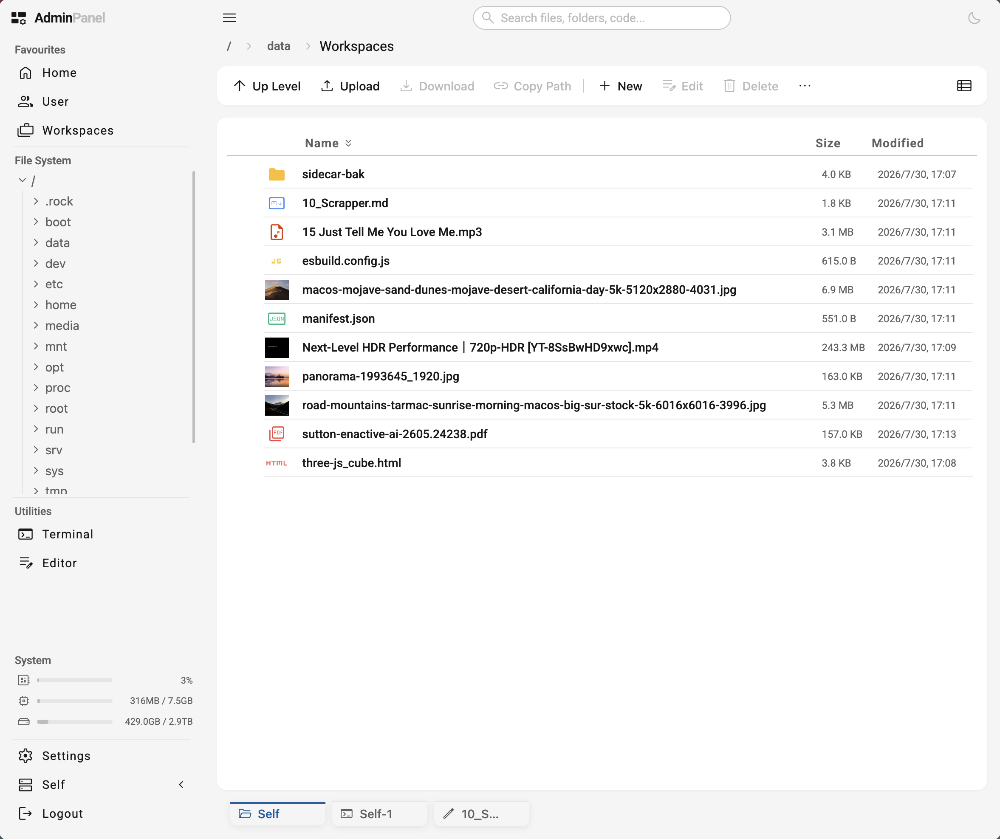
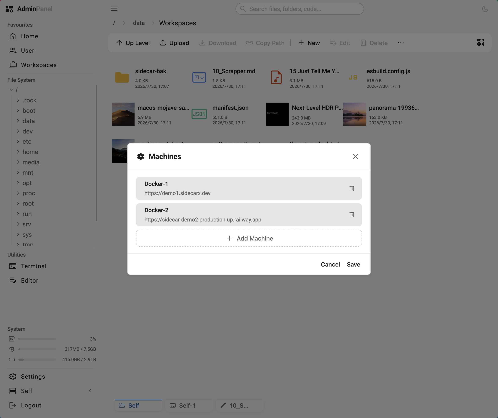
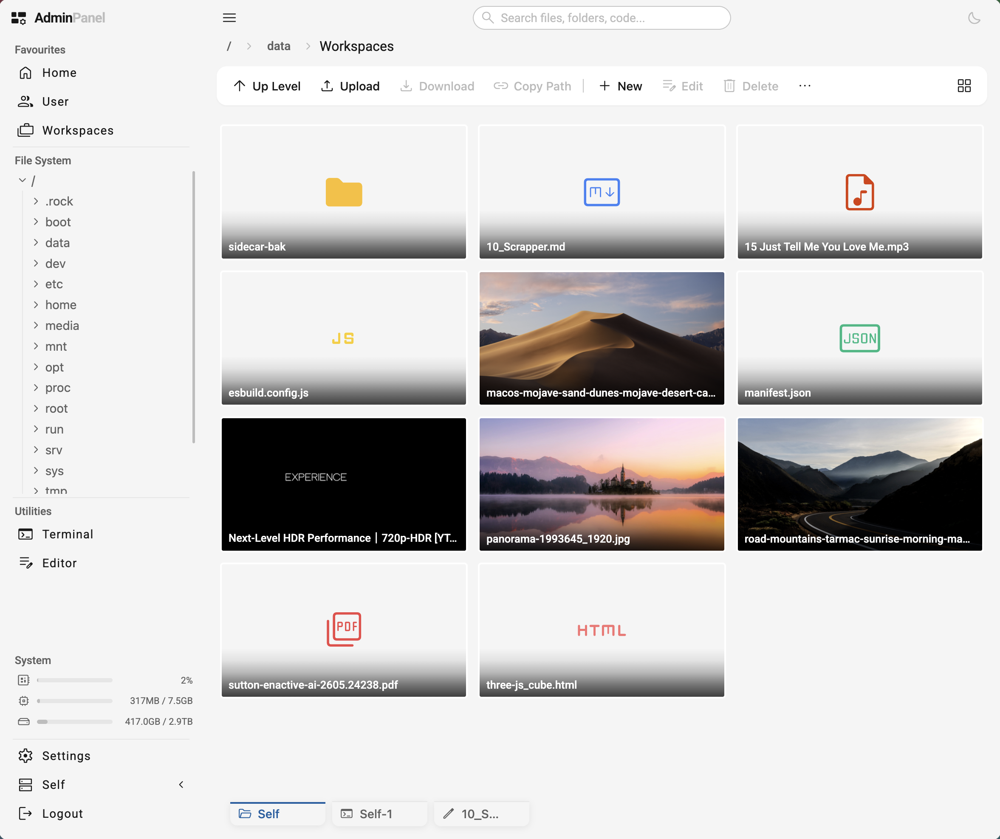
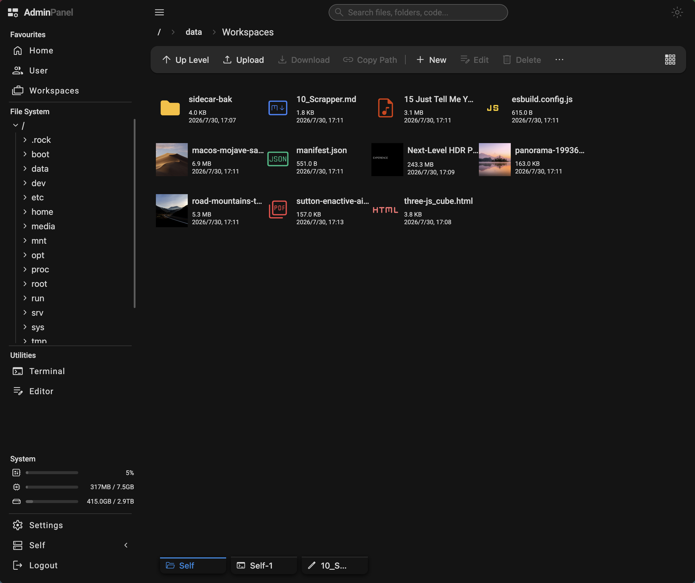
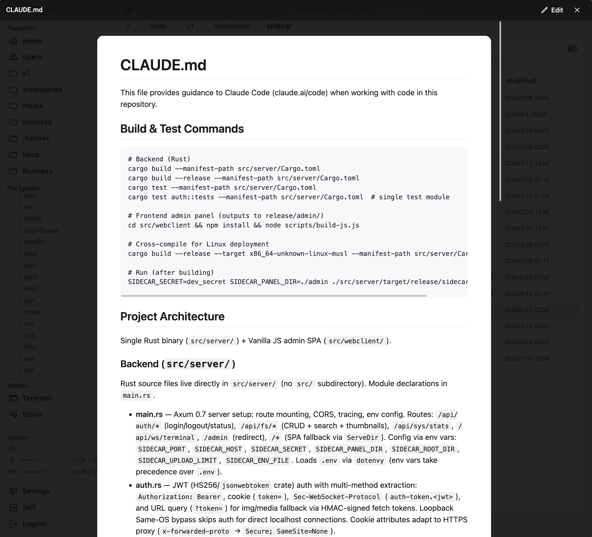
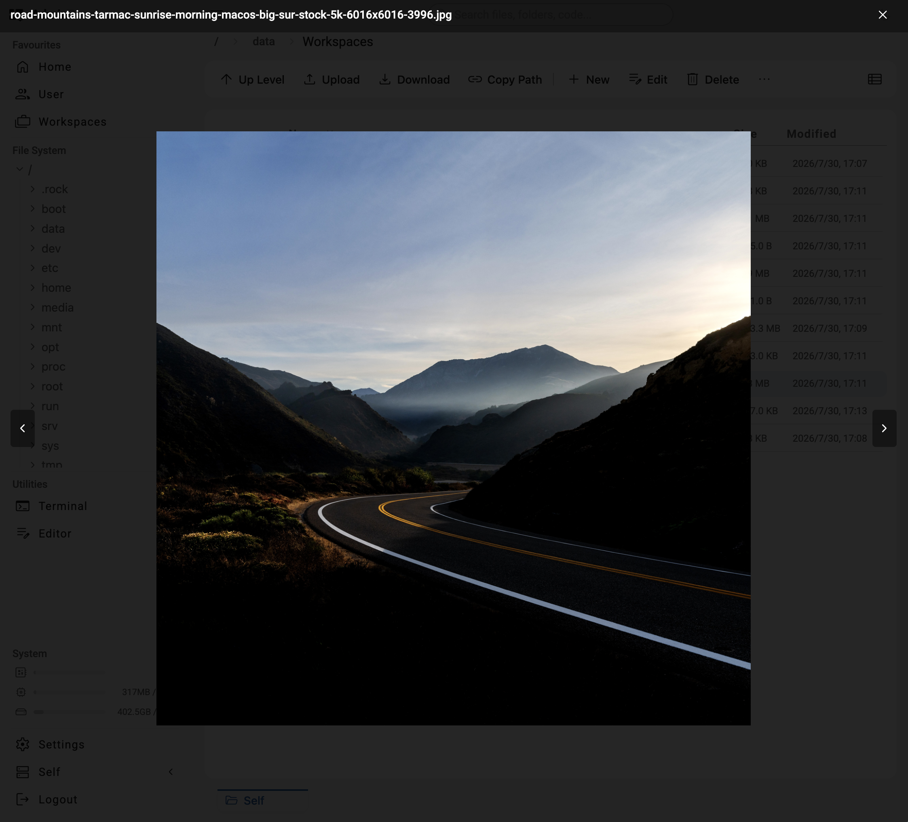
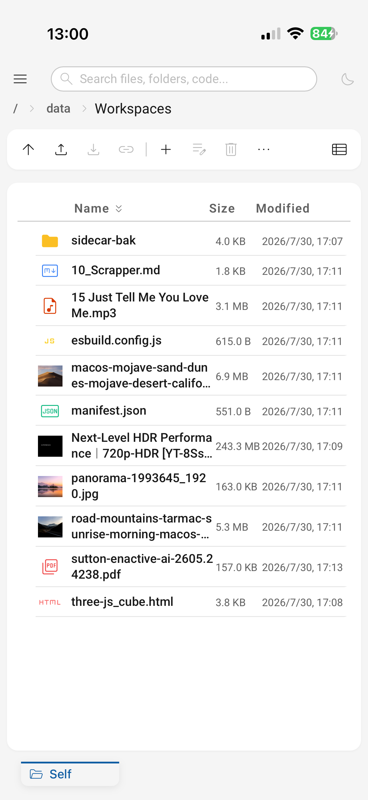
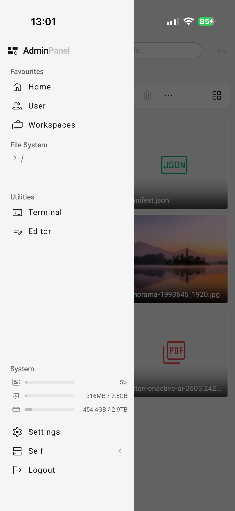
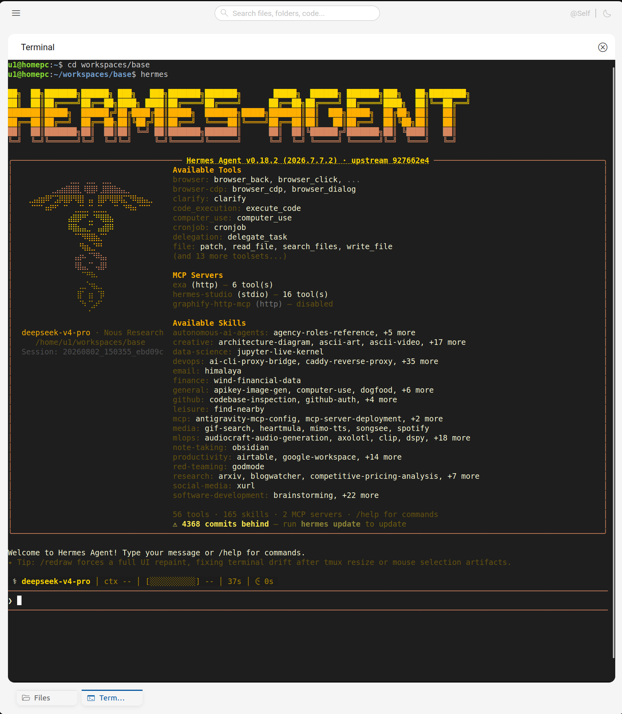

# SidecarX

> **X** stands for Cross — cross-machine file operations.

A lightweight, high-performance Rust server for multi-machine file management. Connect to any number of remote machines from a single browser tab — copy, paste, move files across machines with drag-and-drop.

🌐 **Website**: [sidecarx.dev](https://sidecarx.dev) &nbsp;|&nbsp; 🚀 **Live Demo**: [demo.sidecarx.dev](https://demo.sidecarx.dev)



---

## Why SidecarX?

There are many file browsers on GitHub. Here's why SidecarX exists.

### vs. File Browser — the most popular alternative

[File Browser](https://github.com/filebrowser/filebrowser) is a mature, widely-adopted project. SidecarX builds on that foundation but is purpose-built for the AI-agent era:

| Capability | File Browser | SidecarX |
|---|---|---|
| **Terminal** | Shell execute only (no TTY) | Full WebSocket PTY terminal — interactive shell, resize-aware |
| **Code Editor** | Basic text editor | Advanced code editor with syntax highlighting (third-party) |
| **Preview** | Text + images | Lightbox viewer: Video, Image, Audio, PDF, Markdown, HTML |
| **Markdown Preview** | Not supported | Native Markdown rendering — critical for AI-generated content |
| **HTML Preview** | Not supported | Live HTML preview with security sandbox (CDN/external JS allowed; local JS blocked) |
| **Multi-Machine** | Single-instance only | Connect N machines from one browser tab with cross-machine clipboard |

### vs. Docker/Kubernetes monitoring platforms

SidecarX is **not** a DevOps dashboard. No CI/CD, no container orchestration, no metrics pipelines. It is a pure, focused multi-machine file browser — simple, direct file management and terminal access across all your machines. No complexity you didn't ask for.

### vs. other multi-machine tools

The closest alternative in the multi-machine space is [file-explorer](https://github.com/bentossell/file-explorer), which uses a **hub-and-spoke** model: one central hub proxies all traffic to remote machines. SidecarX adopts a **peer-to-peer** model — every instance is an independent node with its own panel, its own server, and the ability to connect to others. No single point of failure, no hub to maintain. Each SidecarX instance is a self-contained, statically-linked Rust binary.

---

## Features

### Unified Multi-Machine Operations
* **Cross-Machine Clipboard**: Copy files on machine A, paste to machine B. No SSH, SCP, or Rsync.
* **Cross-Machine Drag-and-Drop**: Drag files between machines in a single browser window.
* **Unified Workspace**: Editors and terminals for all connected machines inside one tab dock.
* **Centralized Config**: Define all target machines in `admin_cfg.json`, switch with one click.



### Advanced Lightbox Previewer
* **Universal Preview**: Overlay-based viewer supporting Video, Image, Audio, PDF, Markdown, and HTML.
* **Security-First Sandboxing**: In-place HTML rendering with native element sandboxing. Token-in-URL isolation — fetch tokens are strictly separate from auth tokens.
* **Maximized Cache Efficiency**: Default 7-day browser cache TTL. Configurable down to 1 day, 4 hours, or 1 hour for high-security environments.

### Core File & Terminal Capabilities
* **File Management**: Remote search (regex/glob), upload/download, batch ZIP, directory ops, video frame extraction (optional `ffmpeg`).
* **Interactive Terminal**: WebSocket PTY (`xterm.js` / `portable-pty`) with responsive resize.
* **Jail Isolation**: `SIDECAR_ROOT_DIR` sandboxes all file operations — path-traversal hardened.



### UI Design Highlights
* **Business Sleek**: Professional, minimal, performance-engineered visual style.
* **Human Taste**: Hand-calibrated aesthetics — organic, not AI-generated.
* **Pure Handcrafted CSS**: 1,000+ lines of custom CSS. Zero UI frameworks, zero component libraries, zero CDN stylesheets. Every style is embedded and pixel-perfected by hand.

---

## Gallery

Dark theme:



Markdown preview overlay:



Media preview overlay:



Mobile responsive:



Mobile responsive (sidebar):



Terminal running Hermes Agent:



---

## Installation & Deployment

Choose the method that matches your architecture:

### 1. One-Line Script Install
For local machines or cloud VPS hosts. Downloads, configures, and installs SidecarX:
```bash
curl -fsSL https://raw.githubusercontent.com/m1k-rsch/sidecarX/main/install.sh | bash
```
*(On native VPS hosts, SidecarX registers as a standard `systemd` service.)*

### 2. Docker Deployment
For Docker or container runtimes (e.g., Railway).
* **Container Scripting**: No SSH? Run the install script directly inside the container.
* **SupervisorD**: Production `Dockerfile` template uses `supervisord` as PID 1.
* **Co-location**: Bundle your `Main App` side-by-side with SidecarX in the same container.
* **Config**: See [`docker-deploy/`](docker-deploy/) for the `Dockerfile`, `supervisord.conf`, and `start.sh` template.

---

## Configuration

Set via environment variables or `.env`:

| Variable | Default | Description |
|----------|---------|-------------|
| `SIDECAR_PORT` | `3000` | Server port |
| `SIDECAR_HOST` | `0.0.0.0` | Bind address |
| `SIDECAR_SECRET` | — | JWT signing secret (**required in production**) |
| `SIDECAR_PANEL_DIR` | `./admin` | Admin panel static files directory |
| `SIDECAR_ROOT_DIR` | — | Jail directory for sandboxed file operations |
| `SIDECAR_UPLOAD_LIMIT` | `1024` | Upload size limit in MB |
| `SIDECAR_ENV_FILE` | `.env` | Path to env file |

---

## API Reference

All API specifications live in the `docs-and-specs/` directory. Refer there for endpoint details, request/response models, and route documentation.

---

## Releases

Current release: **v0.1.0**

Pre-built binaries on the [GitHub Releases](https://github.com/m1k-rsch/sidecarX/releases) page:

| Platform | Binary |
|----------|--------|
| **Linux (x86_64)** | `sidecar-x86_64-unknown-linux-musl` |
| **Linux (ARM64)** | `sidecar-aarch64-unknown-linux-musl` |
| **macOS (Apple Silicon)** | `sidecar-aarch64-apple-darwin` |

---

## Open Source Components

| Library | License | Role |
|---------|---------|------|
| [Monaco Editor](https://github.com/microsoft/monaco-editor) | MIT | Code editor |
| [xterm.js](https://github.com/xtermjs/xterm.js) | MIT | Terminal emulator |
| [Lit](https://github.com/lit/lit) | BSD-3-Clause | Web Components |
| [marked](https://github.com/markedjs/marked) | MIT | Markdown rendering |
| [Material Symbols](https://fonts.google.com/icons) | Apache 2.0 | Icons |
| [Roboto](https://fonts.google.com/specimen/Roboto) | OFL | Font |

---

## License

Apache 2.0 © 2026 SidecarX Contributors

---

## Links

- Website: [sidecarx.dev](https://sidecarx.dev)
- Live Demo: [demo.sidecarx.dev](https://demo.sidecarx.dev)
- GitHub: [github.com/m1k-rsch/sidecarX](https://github.com/m1k-rsch/sidecarX)
